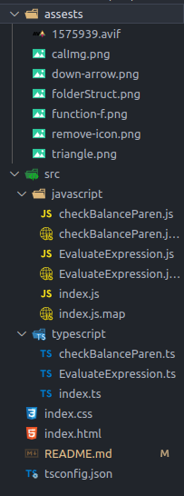

# Scientific-Calculator-Practical-TS

This is a scientific calculator project built using HTML, CSS, Javascript and Typescript. The calculator is designed to perform advanced mathematical operations, including trigonometric and logarithmic functions. It is suitable for use by both beginners and experienced mathematicians.

## **Folder Structure**

The folder structure for this project is as follows:

- **`index.html`**: the main HTML file for the calculator
- **`index.css`**: the CSS file containing styles for the calculator
- **`index.js`**: the JavaScript file containing all the logic for the calculator
- **`README.md`**: the file you are currently reading
    
    
    

## **Features**

The scientific calculator comes with a range of advanced features that make it a powerful tool for performing complex calculations. These include:

- **Basic arithmetic operations:** The calculator can perform basic arithmetic operations such as addition, subtraction, multiplication, and division.
- **Trigonometric functions:** The calculator supports trigonometric functions such as sine, cosine, and tangent, making it useful for calculating angles and other advanced calculations.
- **Logarithmic functions:** The calculator can perform logarithmic functions, including natural logarithms and logarithms to base 10, making it useful for a variety of advanced calculations.
- **Exponential functions:** The calculator supports exponential functions, making it useful for calculations involving growth and decay.
- **Square root and cube root:** The calculator can perform square root and cube root calculations, making it useful for a variety of advanced calculations.
- **Memory functions:** The calculator has a memory function that allows users to store and recall values for later use.
- **Clear button:** The calculator comes with a clear button that allows users to reset the display and start fresh.
- **Support for parentheses:** The calculator supports parentheses, which makes it easy to group expressions together and perform complex calculations.
- **Support for negative numbers:** The calculator supports negative numbers, making it useful for a wide variety of calculations.
- **Snapshot:**
    
    
    

## **How to Use**

Using the scientific calculator is straightforward. Users can click the buttons on the calculator to input numbers and operators. The memory functions can be used to store and recall values, and the parentheses button can be used to group expressions together. The clear button can be used to reset the display.

## **Installation**

To install the scientific calculator, users can clone the repository or download the files. Once downloaded, users can open the index.html file in a web browser to start using the calculator.